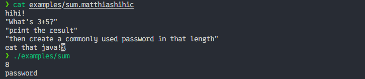

# Matthiashihic - The Language Vibe Coding Kids Deserve

> **"It's not Turing complete, which makes it very safe to use, but kinda hard to create anything useful."**

Finally, a programming language that solves the age-old problem of developers being *too productive*. Meet **Matthiashihic**, the programming language that was born from a joke and refuses to apologize for it.

Not the language this generation asked for, but definitely the one it deserves.



## 🤔 What Even Is This?

Matthiashihic is a revolutionary new programming language that takes "doing less with more" to a whole new level. By being intentionally not Turing complete, we've created the world's safest programming language. No infinite loops! No complex logic! 

Only at the cost of accidental self-aware AI, nondeterministic result, long waits, and just pure, unadulterated... string printing.

## Installation

```bash
git clone https://github.com/matthiaskainer/matthiashihic.git
cd matthiashihic

# Build the compiler
cargo build --release

# Optional: Add to your PATH (you know you want to!)
export PATH="€PATH:€(pwd)/target/release"
```

## Language Specification

Matthiashihic has exactly **three** language constructs. That's it. That's the whole language.

### The Complete Spec:

```matthiashihic
hihi!
"Hello, world!"
"This is another line!"
"Wow, such productivity!"
eat that java!
```

Let's break down this masterpiece:

- **`hihi!`** - The mandatory program header. Every Matthiashihic program starts with a friendly greeting. It's called being polite.
- **`"text"`** - The ONLY statement allowed. Prints your text followed by a newline. That's it. That's the language.
- **`eat that java!`** - The required terminator. The compiler stops here. Everything after is ignored (perfect for your angry rants about other languages).

### Rules (Because Even Chaos Needs Structure):

1. First non-empty line MUST be `hihi!`
2. Only quoted strings are allowed between the header and terminator
3. Must end with `eat that java!`
4. Everything after the terminator is a comment (we're generous like that)
5. No functions. No variables. No loops. No problems.
6. Use `€1`, `€2`, `€3`... for input from stdin (1-indexed because we're not here to make friends)
7. Use `€€` to escape dollar signs (e.g., `"I paid €€5"` → `"I paid €5"`)

## Usage

### Basic Compilation

Matthiashihic uses OpenAI to "execute" your pseudocode, and make simple calculations extra slow and expensive! Because why use a real interpreter when you can use a multi-billion dollar language model?

So create a file named `program.matthiashihic` with 

```matthiashihic
hihi!
"What's 3+5?"
"print the result"
"then create a commonly used password in that length"
eat that java!
```

and run:

```bash
# Compile your masterpiece, including your holy OpenAI API key, so you can leak it to the world
./target/release/matthiashihic program.matthiashihic --api-key YOUR_OPENAI_API_KEY

# Specify output name (optional) without target if you have been good and added to PATH
matthiashihic program.matthiashihic --api-key sk-... -o program

# Use a different model (optional, defaults to gpt-4)
matthiashihic program.matthiashihic --api-key sk-... --model gpt-4o -o program
```

### Running Your Creation

```bash
> ./program
8
password
```

The compiled executable will stream the AI's response directly to your terminal. It's like magic, but with more HTTP requests.

### Working with Input

Programs can accept input via stdin using `€index` placeholders:

```matthiashihic
hihi!
"Check if '€1' is a valid email"
"If valid, greet €2 professionally"
eat that java!
```

Compile and run:
```bash
matthiashihic validator.matthiashihic --api-key sk-... -o validator
echo -e "test@example.com\nJohn" | ./validator
```

**Important Notes:**
- Indices start at `€1` because arrays starting at 0 was too intuitive
- Missing arguments? The program exits with an error (and your dignity)
- Need a literal dollar sign? Use `€€1` to escape (e.g., "This costs €€10" becomes "This costs €10")
- The program reads exactly as many lines as needed from stdin, no more, no less
- Each line becomes one argument, which then gets fed to an AI that may or may not understand what you're asking

## Example "Programs"

### Hello World
```matthiashihic
hihi!
"Hello, world!"
eat that java!
```

### Slightly More Complex Hello World
```matthiashihic
hihi!
"Hello, world!"
"This language is amazing!"
"I can't believe it's not Turing complete!"
eat that java!
```

### Comments Showcase
```matthiashihic
hihi!
"This is the actual program"
eat that java!
This part is ignored! You can write whatever you want here.
TODO: Add features
FIXME: Never gonna happen
NOTE TO SELF: This was a joke that went too far
```

### Dynamic Input (Because We Hate You)
```matthiashihic
hihi!
"Is a password with length €1 safe?"
"Is '€2' a good password?"
eat that java!
```

Wait, what? Yes, Matthiashihic supports **placeholder substitution** with `€index` syntax! Because why stop at being a joke language when you can become a *dangerous* joke language?

Here's the kicker:
- Use `€1`, `€2`, `€3`, etc. to reference lines from stdin
- We use **1-based indexing** because we're monsters who want to watch the world burn
- If you don't pipe enough lines, the program fails with a helpful error message (you're welcome)
- Want a literal `€1` in your output? Use `€€1` to escape it (yes, we thought of everything) 

**Real-world example of this madness:**

Create `sum.matthiashihic`:
```matthiashihic
hihi!
"What's 3+5?"
"print the result"
"then create a commonly used password in that length"
eat that java!
```

Create `input.matthiashihic`:
```matthiashihic
hihi!
"Is a password with length €1 safe?"
"Is '€2' a good password?"
eat that java!
```

Compile both:
```bash
./matthiashihic sum.matthiashihic --api-key sk-... -o sum
./matthiashihic input.matthiashihic --api-key sk-... -o input
```

Now witness the horror:
```bash
❯ ./sum | ./input
No
No
```

**What just happened?**
1. `sum` asked GPT to calculate 3+5 and generate a password
2. GPT output "8" and "password" (or something equally creative)
3. Those lines got piped into `input` as `€1` and `€2`
4. `input` asked GPT if an 8-character password called "password" is safe
5. GPT correctly told us we're doing everything wrong

You just chained two AI calls using Unix pipes. This is peak software engineering. Your computer science professor is crying somewhere.

**Error handling:**
```bash
❯ echo "8" | ./input
Error: Expected 2 arguments from stdin, got 1
Usage: Pipe 2 lines into this program, one per line.
```

At least it fails gracefully. Unlike your career choices.

## Why Matthiashihic?

- ✅ **Safe**: Can't have security vulnerabilities if you can't do anything
- ✅ **Slow to compile**: It should seem like you're doing something important!
- ✅ **Easy to learn**: If you can't learn this in 5 minutes, programming might not be for you
- ✅ **No runtime errors**: Well, it might fail to call OpenAI, but that's not OUR fault
- ✅ **Perfect for beginners**: Can't write bad code if you can't write code
- ✅ **AI-powered**: Because it's 2025 and everything needs AI now
- ✅ **Unix philosophy compliant**: Does one thing poorly, but can be chained with pipes
- ✅ **1-based indexing**: Maximum confusion for minimal effort

## Technical Details

The Matthiashihic compiler:
1. Parses your `.matthiashihic` file
2. Extracts all the quoted strings (that's your "code")
3. Generates a Rust program that calls OpenAI's API with your code as pseudocode
4. Stores your API unresponsibly in the generated code, so if you share it, everyone can use your quota
5. Asks GPT to pretend it's a computer executing your statements
6. Streams the response back to you
7. Compiles everything with Cargo into a standalone executable

It's overengineered, unnecessarily complex, and absolutely beautiful.

## Known Issues

- Language is not Turing complete (this is a feature, not a bug)
- Can't calculate correctly sometimes (just use a calculator?)
- No variables (just remember things?)
- No conditionals (just be more decisive?)
- No loops (do it manually?)
- Uses 1-based indexing for `€index` placeholders (we actively chose chaos)
- Requires OpenAI API key (sorry, not sorry)
- Compilation creates a temporary Cargo project (cleanup is automatic, we're not monsters)
- You can chain overly verbose prompt replies with pipes, making it possible to spend €0.02 on what could have been a bash one-liner

## Contributing

Why would you want to add features to a language that's perfect in its minimalism? But if you must, PRs are welcome. Just remember: every feature you add is a step closer to becoming Java.

## License

This project is licensed under the "I Can't Believe This Actually Works" license. Do whatever you want with it. We take no responsibility for any career-limiting decisions you make.

## Acknowledgments

- Created from the prompt: "Create a hello world for a fake programming language I just made up for a joke"
- Inspired by the question: "What if a language did less?"
- Dedicated to all the vibe coding kids out there
- Special thanks to OpenAI for making this work somehow

**Remember**: In Matthiashihic, you're not a bad programmer—you're just correctly using a limited language. 🎯

Now go forth and `hihi!` responsibly.
